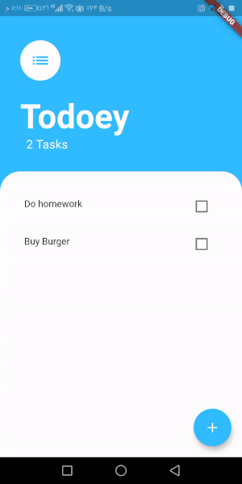

# Todoey ✓

## App Goal

Understanding how to manage state in Flutter architecture through different choices and learn to use the officially recommended Provider package to manage our app state.

## What's New in this App

A todolist app to keep track of all tasks.

## Todoey App Demo

## New Skills

- Understand state (Data) and state management (Data Management).
- Understand the difference between ephemeral (local) state and app state.
- Problems that come with simply relying on setState().
- Understand Prop Drilling.
- Examine various popular ways of managing app state for Flutter projects.
- Learn about the List Builder.
- Use the Flutter BottomSheet Widget.
- Learn to lift state up to be able to access it from children widgets.
- Learn about design patternsl.
- Understand Provider package usage and management in app state.
